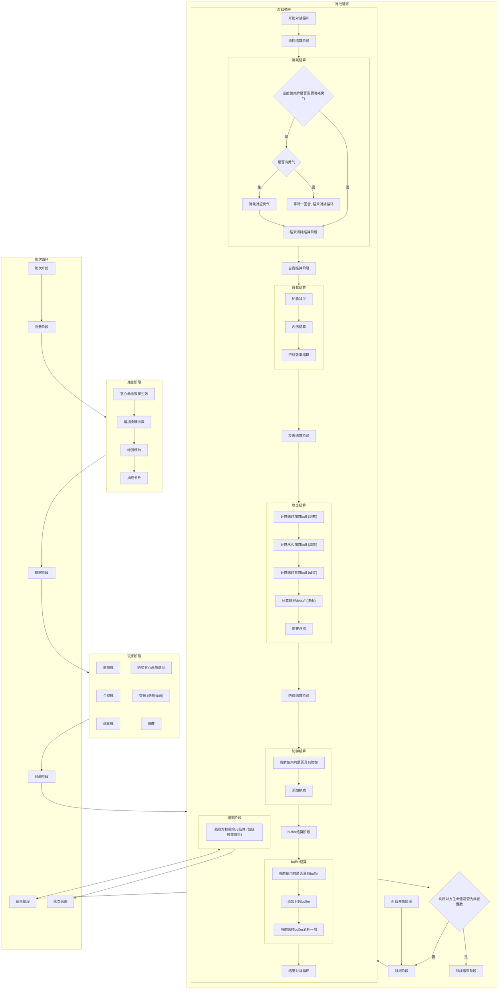

```mermaid
flowchart TB
%%    j1["判断是否存在永久加算buff (加攻) "]
%%    j2["判断是否存在临时加算buff (剑意) "]
%%    j3["判断是否存在临时乘算buff (破绽) "]
%%    j4["判断是否存在debuff (虚弱) "]
%%    j5["  "]
%%    j["  "]

subgraph l1["准备阶段"]
direction TB
r0[" 玄心命坊效果生效 "] --> 
        r1[" 增加换牌次数 "] -->
r2[" 增加修为 "] -->
r3[" 抽取卡片 "]
end

subgraph l2["玩家阶段"]
direction TB
p1[" 置换牌 "] ~~~
p2[" 合成牌 "] ~~~
p3[" 炼化牌 "]

p4[" 购买玄心命坊商品 "] ~~~
p5[" 突破 (选择仙命) "] ~~~
p6[" 道藏 "]
end

subgraph l3["对战循环"]
direction TB

lb1["对战开始阶段"]
lb2["对战阶段"]
subgraph lb3["对战循环"]
direction TB
开始对战循环 -->
消耗结算阶段 --> b0 -->
自我结算阶段 --> b1 -->
攻击结算阶段 --> b2 -->
防御结算阶段 --> b3 -->
buffer结算阶段 --> buffer结算 -->
结束对战循环

subgraph b0["消耗结算"]
direction TB
b01{" 当前使用牌是否需要消耗灵气 "} -->
|是|b02{" 是否有灵气 "} -->
|是| 消耗对应灵气 --> b03

b01 -->|否| b03[" 结束消耗结算阶段 "]

b02 --> |否|b04[" 等待一回合, 结束对战循环 "]
end

subgraph b1["自我结算"]
direction TB
护盾减半 -->
内伤结算 -->
持续效果结算
end

subgraph b2["攻击结算"]
direction TB
b21[" 计算临时加算buff (剑意) "] -->
b22[" 计算永久加算buff (加攻) "] -->
b24[" 计算临时乘算buff (破绽) "] -->
b25[" 计算临时debuff (虚弱) "] -->
b26[" 伤害总结 "]
end

subgraph b3["防御结算"]
direction TB
b31[" 当前使用牌是否具有防御 "] -->
b32[" 添加护盾 "]
end

subgraph buffer结算
direction TB
当前使用牌是否具有buffer --> 添加对应buffer --> 
当前临时buffer消耗一层
end

subgraph l4["结束阶段"]
direction TB
e1[" 战败方扣除命元结算 (包括技能效果) "]
end
end

lb4{"判断对方生命值是否为非正整数"}
lb5["对战结束阶段"]

lb1 --> lb2
lb2 --> lb3
lb3 --> lb4
lb4 -- 否 --> lb2
lb4 -- 是 --> lb5
end


subgraph 轮次循环
direction LR
START[" 轮次开始 "]
s1[" 准备阶段 "]
s2[" 玩家阶段 "]
s3[" 对战阶段 "]
s4[" 结束阶段 "]
END[" 轮次结束 "]
end
START --> s1 --> l1 --> s2 --> l2 --> s3 --> l3 --> s4 --> l4 --> END
``` 